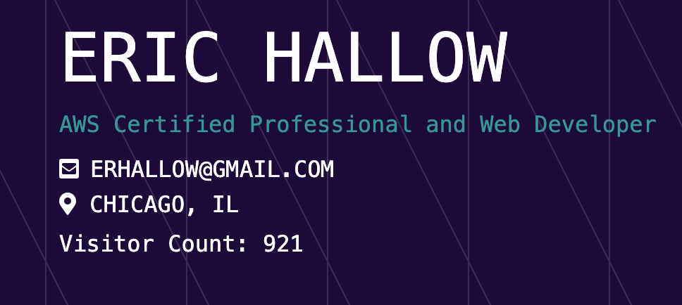
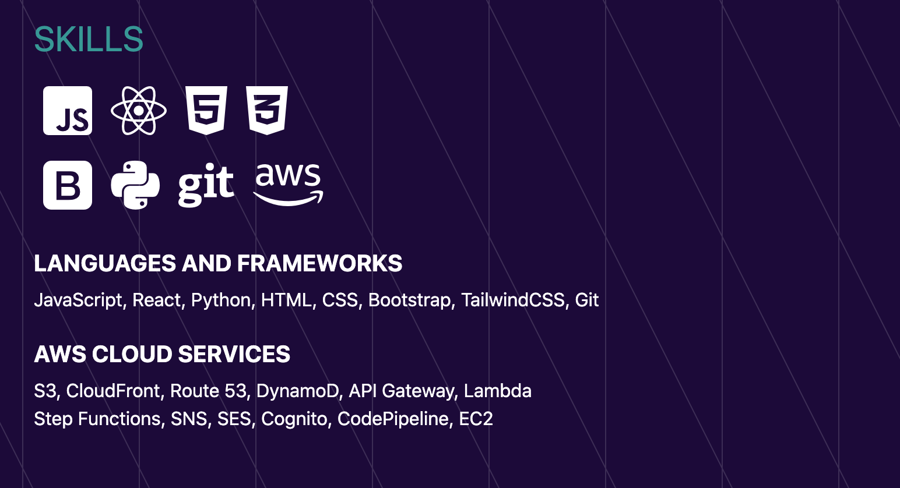
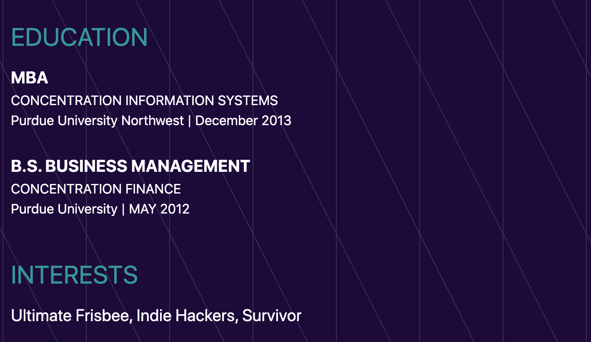
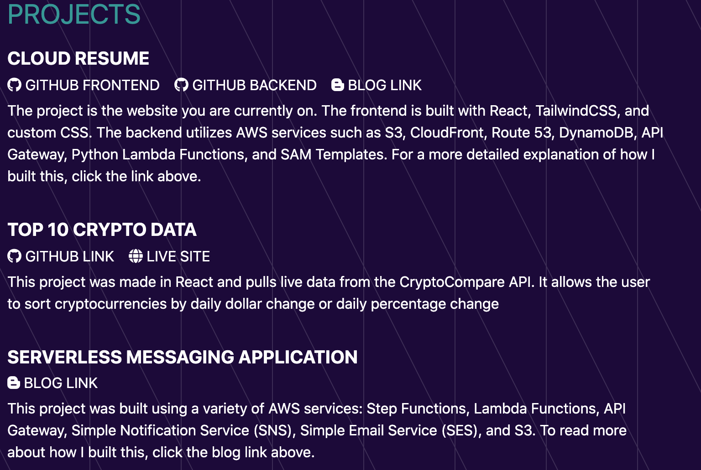

# Cloud Resume

This project was built for the Cloud Resume Challenge. The details of the challenge can be found at https://cloudresumechallenge.dev/. It utilizes a variety of AWS services to host a resume website. Its was built in React and styled with TailwindCSS and Custom CSS. This project was bootstrapped with [Create React App](https://github.com/facebook/create-react-app).

# AWS 

This project is hosted with AWS S3 buckets, CloudFront distributions, and Route 53 routing. The backend is built with DynamoDB, Lambda functions, and the API Gateway. This code is deployed using SAM templates. The backend code is in a separate repository (https://github.com/erhallow/cloud-resume-backend).

# Counter

The visit counter was built using all these backend services. We access the API gateway in the React App.js file. The API gateway triggers the Lambda function which is coded in Python to add 1 to a visitorCount variable stored in a DynamoDB table. 

# Blog

To read about how I built this project, check out this blog where I detailed my process (https://erhallow.hashnode.dev/cloud-resume-challenge-ckg1f6bhb01oiw6s1dd5399qv)

# Screenshots

Below are a few screenshots of my Cloud Resume. Check out the full website here (https://erichallow.com).

## Skills Section

## Education Section

## Projects Section

